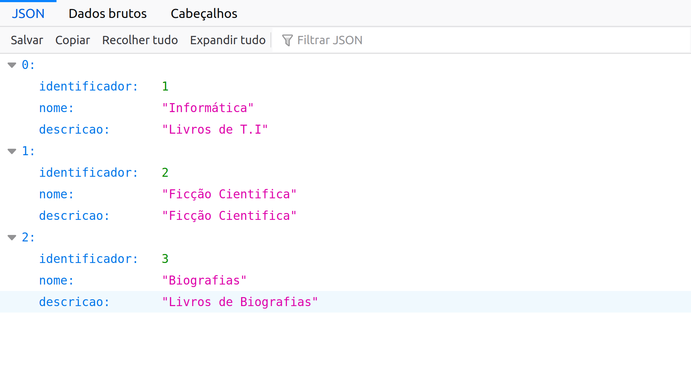

# api-rest-livraria

Simple project using spring boot for build REST API.

System requirements
-------------------

All you need to build this project is Java 7.0 (Java SDK 1.7) or better, Maven 3.1 or better.

The application this project produces is designed to be run on JBoss WildFly.

Build and Running
-------------------------

1. In command line mvn clean install
2. Open a command line and navigate to the directory  target in project
3. The command java -jar livraria-0.0.1-SNAPSHOT.war running application
4. http://localhost:8080/categorias 
